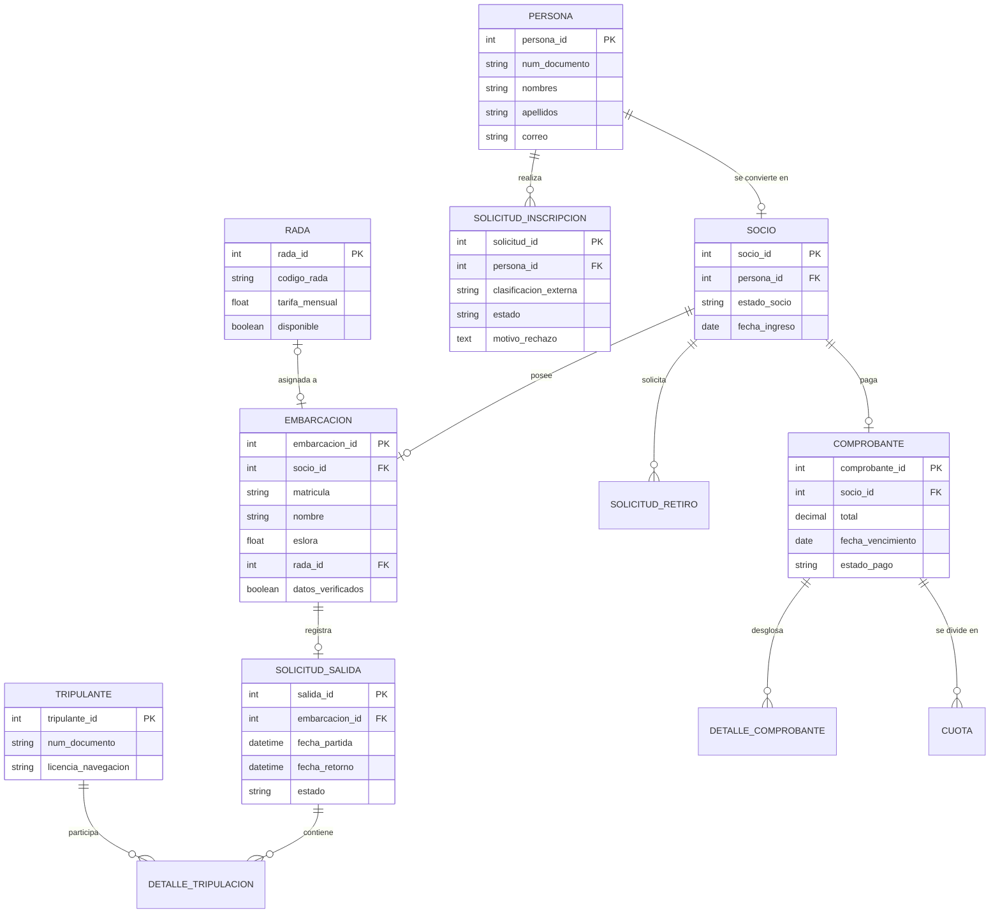
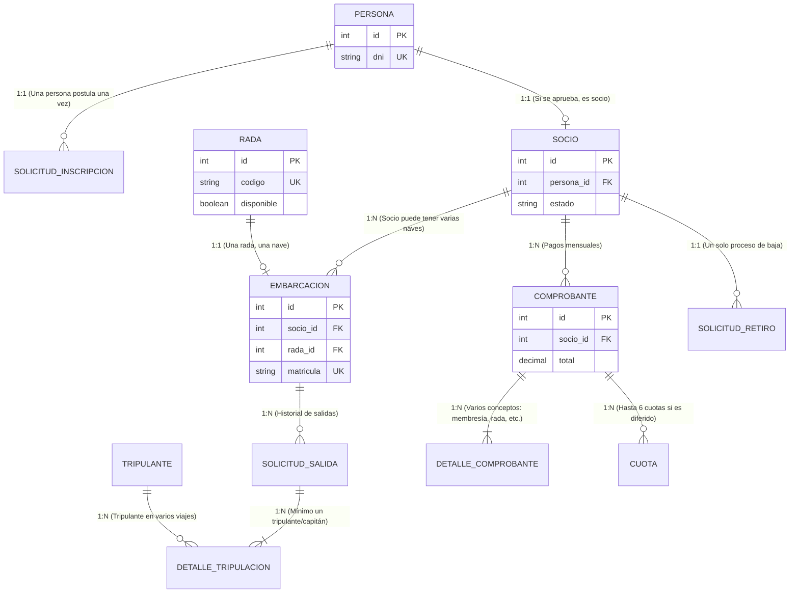

## 1. Diagrama de Entidad-Relación (E-R) Lógico

Para comprender la estructura de las tablas y cómo se comunican entre sí, a continuación se detalla el flujo de datos principal:

- **Personas y Socios**: Todo inicia con una persona que postula mediante una solicitud. Si es aprobada, se convierte en socio.
    
- **Embarcaciones y Radas**: Los socios registran sus naves, se validan sus datos y se les asigna un espacio de amarre (Rada).
    
- **Uso de Embarcaciones**: Se registran las solicitudes de salida con su respectiva tripulación e itinerario.
    
- **Facturación y Pagos**: Los conceptos de cobro (membresía, rada, servicios) generan comprobantes que el socio liquida.
    

---

## 2. Script DDL en SQL (PostgreSQL)

Este script crea los tipos enumerados (`ENUM`) para garantizar la integridad de los estados y las tablas con sus respectivas llaves primarias (`PRIMARY KEY`), foráneas (`FOREIGN KEY`) y restricciones de integridad.

SQL

```SQL
-- =============================================================================
-- 1. TIPOS ENUMERADOS (Para control de estados y políticas de negocio)
-- =============================================================================

CREATE TYPE estado_solicitud AS ENUM ('PENDIENTE', 'APROBADA', 'RECHAZADA');
CREATE TYPE tipo_socio AS ENUM ('PAGADOR', 'PAGADOR_ESPORADICO', 'RENUENTE');
CREATE TYPE estado_socio AS ENUM ('ACTIVO', 'INACTIVO', 'RETIRADO');
CREATE TYPE estado_salida AS ENUM ('PENDIENTE', 'APROBADA', 'RECHAZADA');
CREATE TYPE tipo_comprobante AS ENUM ('BOLETA', 'FACTURA');
CREATE TYPE estado_pago AS ENUM ('PENDIENTE', 'PAGADO', 'ANULADO');

-- =============================================================================
-- 2. MÓDULO: PERSONAS Y SOCIOS
-- =============================================================================

-- Tabla base para almacenar datos de postulantes y socios
CREATE TABLE personas (
    persona_id SERIAL PRIMARY KEY,
    tipo_documento VARCHAR(10) NOT NULL,
    numero_documento VARCHAR(20) UNIQUE NOT NULL,
    nombres VARCHAR(100) NOT NULL,
    apellidos VARCHAR(100) NOT NULL,
    telefono VARCHAR(20),
    correo VARCHAR(100) UNIQUE,
    direccion TEXT,
    fecha_registro TIMESTAMP DEFAULT CURRENT_TIMESTAMP
);

-- Solicitudes de inscripción
CREATE TABLE solicitudes_inscripcion (
    solicitud_id SERIAL PRIMARY KEY,
    persona_id INTEGER NOT NULL REFERENCES personas(persona_id),
    clasificacion_externa tipo_socio NOT NULL, -- Verificación de otros clubes
    estado estado_solicitud DEFAULT 'PENDIENTE',
    motivo_rechazo TEXT, -- Para subsanación si es rechazada
    fecha_solicitud TIMESTAMP DEFAULT CURRENT_TIMESTAMP,
    fecha_evaluacion TIMESTAMP
);

-- Registro formal de socios aprobados
CREATE TABLE socios (
    socio_id SERIAL PRIMARY KEY,
    persona_id INTEGER NOT NULL UNIQUE REFERENCES personas(persona_id),
    estado_socio estado_socio DEFAULT 'ACTIVO',
    fecha_ingreso DATE DEFAULT CURRENT_DATE,
    fecha_retiro DATE
);

-- Solicitudes de retiro (Proceso de baja)
CREATE TABLE solicitudes_retiro (
    retiro_id SERIAL PRIMARY KEY,
    socio_id INTEGER NOT NULL REFERENCES socios(socio_id),
    fecha_solicitud DATE DEFAULT CURRENT_DATE,
    motivo_retiro TEXT,
    procesada BOOLEAN DEFAULT FALSE
);

-- =============================================================================
-- 3. MÓDULO: EMBARCACIONES Y RADAS
-- =============================================================================

-- Catálogo de radas (Lugares de amarre)
CREATE TABLE radas (
    rada_id SERIAL PRIMARY KEY,
    codigo_rada VARCHAR(20) UNIQUE NOT NULL,
    dimensiones VARCHAR(50) NOT NULL, -- Ejemplo: "12x4 metros"
    caracteristicas_soporte VARCHAR(100),
    tarifa_mensual DECIMAL(10, 2) NOT NULL CHECK (tarifa_mensual >= 0),
    disponible BOOLEAN DEFAULT TRUE
);

-- Registro de embarcaciones por cada socio
CREATE TABLE embarcaciones (
    embarcacion_id SERIAL PRIMARY KEY,
    socio_id INTEGER NOT NULL REFERENCES socios(socio_id),
    nombre_embarcacion VARCHAR(100) NOT NULL,
    matricula VARCHAR(50) UNIQUE NOT NULL, -- Para validar con Capitanía
    eslora DECIMAL(6, 2) NOT NULL,
    manga DECIMAL(6, 2) NOT NULL,
    puntal DECIMAL(6, 2) NOT NULL,
    datos_verificados BOOLEAN DEFAULT FALSE, -- Verificación con la autoridad marítima
    rada_id INTEGER REFERENCES radas(rada_id), -- Rada asignada
    activo BOOLEAN DEFAULT TRUE
);

-- =============================================================================
-- 4. MÓDULO: TRIPULACIÓN Y SALIDAS
-- =============================================================================

-- Registro de tripulantes autorizados
CREATE TABLE tripulantes (
    tripulante_id SERIAL PRIMARY KEY,
    tipo_documento VARCHAR(10) NOT NULL,
    numero_documento VARCHAR(20) UNIQUE NOT NULL,
    nombres VARCHAR(100) NOT NULL,
    apellidos VARCHAR(100) NOT NULL,
    licencia_navegacion VARCHAR(50), -- Documento de autorización marítima
    fecha_vencimiento_licencia DATE
);

-- Solicitudes de salida de navegación
CREATE TABLE solicitudes_salida (
    salida_id SERIAL PRIMARY KEY,
    embarcacion_id INTEGER NOT NULL REFERENCES embarcaciones(embarcacion_id),
    itinerario_viaje TEXT NOT NULL,
    fecha_partida TIMESTAMP NOT NULL,
    fecha_retorno TIMESTAMP NOT NULL,
    estado estado_salida DEFAULT 'PENDIENTE',
    observaciones TEXT,
    CHECK (fecha_retorno > fecha_partida)
);

-- Tabla intermedia: Detalle de pasajeros y tripulantes que van a bordo
CREATE TABLE detalle_tripulacion_salida (
    detalle_id SERIAL PRIMARY KEY,
    salida_id INTEGER NOT NULL REFERENCES solicitudes_salida(salida_id),
    tripulante_id INTEGER REFERENCES tripulantes(tripulante_id), -- NULL si es pasajero sin licencia
    nombre_completo VARCHAR(150) NOT NULL, -- Nombre del tripulante o pasajero
    es_capitan BOOLEAN DEFAULT FALSE
);

-- =============================================================================
-- 5. MÓDULO: FACTURACIÓN, COBRANZAS Y SERVICIOS
-- =============================================================================

-- Catálogo de servicios adicionales
CREATE TABLE servicios_adicionales (
    servicio_id SERIAL PRIMARY KEY,
    nombre_servicio VARCHAR(100) NOT NULL,
    descripcion TEXT,
    tarifa_base DECIMAL(10, 2) NOT NULL CHECK (tarifa_base >= 0)
);

-- Maestro de comprobantes de pago (Membresías, radas, servicios)
CREATE TABLE comprobantes (
    comprobante_id SERIAL PRIMARY KEY,
    socio_id INTEGER NOT NULL REFERENCES socios(socio_id),
    tipo_comprobante tipo_comprobante NOT NULL,
    serie VARCHAR(10) NOT NULL,
    numero VARCHAR(20) NOT NULL,
    subtotal DECIMAL(10, 2) NOT NULL CHECK (subtotal >= 0),
    interes_mora DECIMAL(10, 2) DEFAULT 0.00 CHECK (interes_mora >= 0),
    igv DECIMAL(10, 2) NOT NULL CHECK (igv >= 0),
    total DECIMAL(10, 2) NOT NULL CHECK (total >= 0),
    fecha_emision DATE DEFAULT CURRENT_DATE,
    fecha_vencimiento DATE NOT NULL,
    estado_pago estado_pago DEFAULT 'PENDIENTE',
    pago_diferido BOOLEAN DEFAULT FALSE,
    numero_cuotas_max INTEGER DEFAULT 1 CHECK (numero_cuotas_max <= 6)
);

-- Detalle del comprobante para desglosar lo facturado
CREATE TABLE detalle_comprobante (
    detalle_comp_id SERIAL PRIMARY KEY,
    comprobante_id INTEGER NOT NULL REFERENCES comprobantes(comprobante_id),
    descripcion VARCHAR(255) NOT NULL, -- "Membresía Mayo 2026", "Uso de Rada A-12", etc.
    monto DECIMAL(10, 2) NOT NULL CHECK (monto >= 0)
);

-- Registro de cuotas en caso se apruebe la facturación diferida
CREATE TABLE cuotas_comprobante (
    cuota_id SERIAL PRIMARY KEY,
    comprobante_id INTEGER NOT NULL REFERENCES comprobantes(comprobante_id),
    numero_cuota INTEGER NOT NULL,
    monto_cuota DECIMAL(10, 2) NOT NULL CHECK (monto_cuota > 0),
    fecha_vencimiento DATE NOT NULL,
    estado_pago estado_pago DEFAULT 'PENDIENTE'
);
```

---

## 3. Sustentación de la Arquitectura (Diccionario de Datos)

A continuación se explica el porqué de las decisiones de diseño aplicadas a las tablas clave para tu exposición o entrega académica:

- **`personas` vs `socios`**: Se aplica una técnica de especialización. Todo socio primero fue una persona registrada en el sistema. Al separar `personas` de `socios`, evitamos duplicar datos de contacto de aquellos postulantes que finalmente fueron rechazados.
    
- **`solicitudes_inscripcion`**: Guarda la evaluación previa del postulante, su clasificación como pagador (tras consultar con otros clubes) y los motivos en caso de rechazo.
    
- **`radas` y `embarcaciones`**: Permite controlar qué espacio está libre. En `embarcaciones` se incluye el atributo `datos_verificados` para dejar constancia de que la Dirección de Capitanías aprobó la nave antes de asignarle la rada.
    
- **`solicitudes_salida` y `detalle_tripulacion_salida`**: Resuelve el problema de salidas no autorizadas. Permite validar el itinerario, la tripulación especializada y evitar las retenciones de naves por parte de la autoridad marítima.
    
- **`comprobantes`, `detalle_comprobante` y `cuotas_comprobante`**: Soportan la facturación mensual por membresía, radas y servicios consumidos. Además, la tabla de cuotas permite implementar la **facturación diferida** en un máximo de 6 cuotas mensuales, tal como estipula la política del club.





